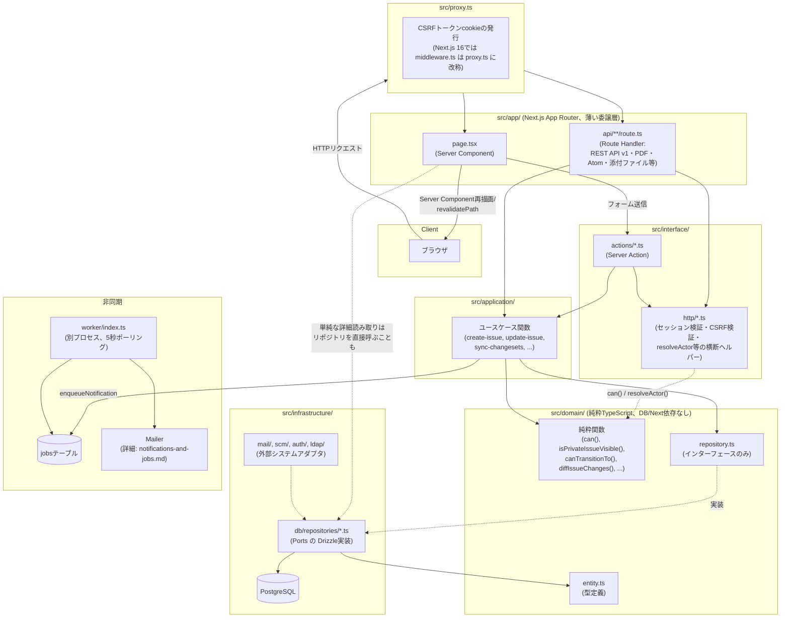
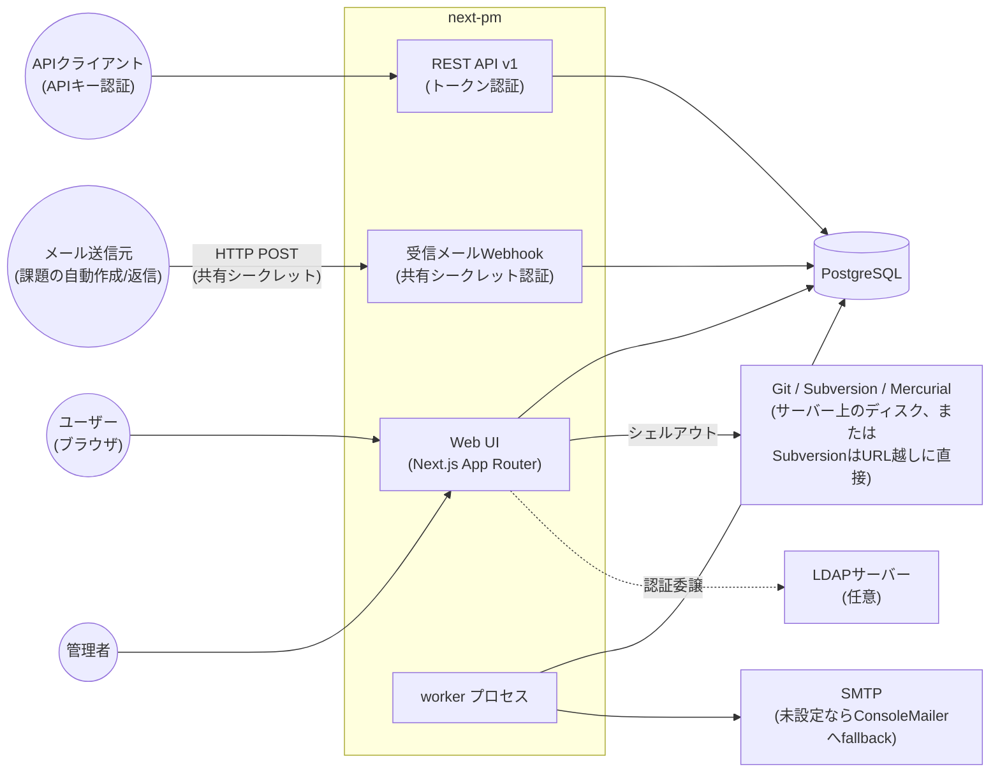

# 設計資料

next-pmの内部設計を俯瞰するための資料群です。「何がどう実装されているか」を素早く把握したいときの入口として使ってください。個々の機能がRedmine本家とどこまで一致しているか(意図的な逸脱を含む)は、ここではなく`../artisan-pm/docs/parity-checklist.md`(姉妹実装であるLaravel版のチェックリスト、next-pmの実装判断でも参照している)が正です — この資料群はあくまで「今のコードがどう組み立てられているか」の説明であり、Redmineとの差分表そのものではありません。

## 資料一覧

| 資料 | 扱う範囲 |
|---|---|
| [`domain-model.md`](domain-model.md) | ドメインモデル全体のER図。プロジェクト構造・課題管理・Wiki・フォーラム/News・工数・SCM・カスタムフィールド・その他(マイページ/2FA/クエリ等)の8領域に分けて掲載 |
| [`authorization.md`](authorization.md) | 権限モデル。`can()`の判定順序、`AuthorizationActor`の解決、非公開課題の可視性(`issuesVisibility`) |
| [`request-lifecycle.md`](request-lifecycle.md) | HTTPリクエストがページ/Server Action/Route Handlerに届く経路、REST APIとの違い、代表的な書き込み処理(ステータス更新)のシーケンス |
| [`issue-workflow.md`](issue-workflow.md) | 課題のステータス遷移(ワークフロー)・フィールド必須/読取専用ルール・楽観的ロック・履歴(Journal)、およびRedmine本家との既知のギャップ |
| [`notifications-and-jobs.md`](notifications-and-jobs.md) | 通知パイプライン(受信者解決・メール送信)とバックグラウンドジョブ(ワーカープロセス)、スケジュール実行が存在しないという事実そのもの |

## 全体構成(レイヤー)

この図で押さえておきたい点:

- **中央集権的な認証ミドルウェアは無い**。`src/proxy.ts`はCSRFトークンcookieの発行だけを行い、ログインの強制やリダイレクトはページ・Server Action・Route Handlerがそれぞれ個別に`currentUserFromCookies()`を呼んで判断する(詳細は`request-lifecycle.md`)。
- **`domain/`は本当にDB非依存**。エンティティの型定義に加え、`can()`・`isPrivateIssueVisible()`・`canTransitionTo()`・`diffIssueChanges()`・`unionRecipients()`のような判定/計算ロジックが全て純粋関数として置かれており、リポジトリのインターフェース(port)もここで定義する——実装(Drizzle)は`infrastructure/`側にあるだけ。
- **書き込みは必ずapplication層のユースケース関数を経由する**が、**単一エンティティの詳細表示のような単純な読み取りは、ページがリポジトリを直接呼ぶことも多い**——「非自明な集約が要る読み取り(アクティビティフィード・検索・マイページ)だけapplication層に置く」という線引きで、Laravel版ほど「Serviceを必ず経由する」を徹底してはいない(詳細は`request-lifecycle.md`)。
- **通知は非同期、だがジョブ種別は`"notify"`しか無い**。ユースケース関数が`enqueueNotification()`を呼び、`jobs`テーブルに積む→別プロセスのワーカーが5秒間隔でポーリングして拾う、という構成。SCM同期のような一見「バックグラウンドっぽい」処理も実際はServer Action内で同期的に実行され、ジョブテーブルを経由しない(詳細は`notifications-and-jobs.md`)。

## システムコンテキスト

Redmineとの対応で意識しておくべき外部依存の違い:

- Redmineの「IMAPポーリングでの受信メール取り込み」に相当する仕組みが、next-pmでは**HTTP Webhook**(`app/api/mail_handler/route.ts`、共有シークレット認証)に置き換わっている——ポーリングではなく、メール側のインフラ(例: SendGrid Inbound Parse等)からのプッシュを受ける形。
- SCMは「プラグインによるアダプタ追加」ではなく、`domain/scm/scm-browser.ts`というポートに対する実装クラス(`infrastructure/scm/*-cli-browser.ts`)を`vendor`列の値に応じて選ぶだけ——実行時のプラグイン読み込み機構自体が無い(next-pmにはRedmineのようなプラグインシステムがまだ無い)。
- Webhook配信機能(Redmine本家には無いが、姉妹Laravel実装は持つ)は**next-pmには無い**。通知はメールのみ。
- スケジュール実行(cron)は一切無い——SCM自動フェッチもウォッチのプルーニングも、next-pmには存在しない。添付ファイルのGCは存在するが、cronではなく次の新規アップロード時に行われる遅延実行(詳細は`notifications-and-jobs.md`)。
