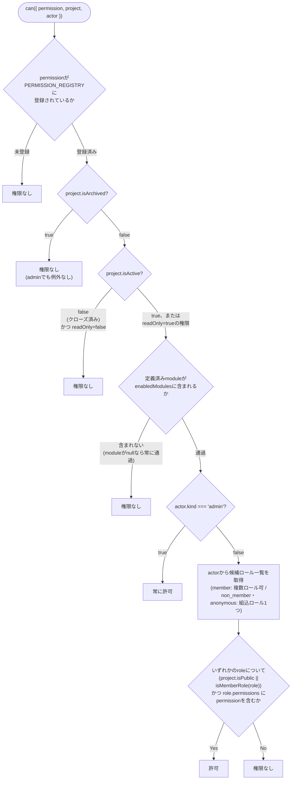
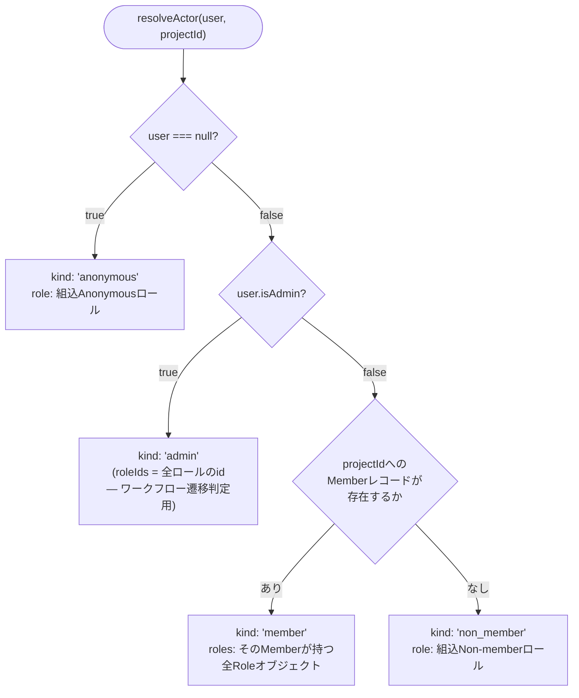
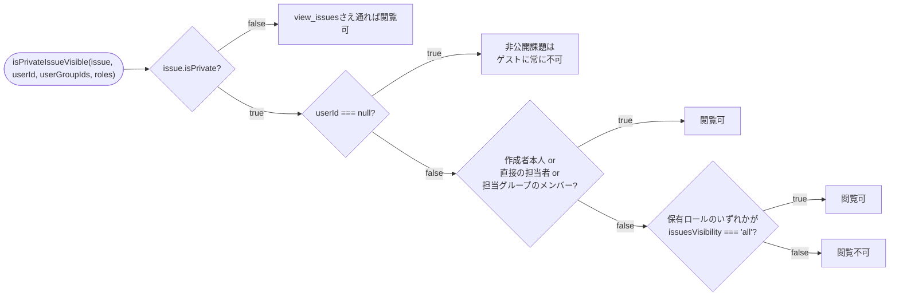

# 権限モデル

Redmineの「プロジェクトごと・ロールごとの権限」モデルを`domain/authorization/authorization-service.ts`の`can()`一関数に集約している。ページ(Server Component)・Server Action・Route Handlerのいずれも、認可判定はこの関数を呼ぶだけで、ロール解決ロジックを自前で持たない。

## `can()`の判定順序

`can()`はRedmineの`Project#allows_to?` → `User#allowed_to?` → `Role#allowed_to?`を1つの純関数に落とし込んだもので、判定順序はRuby側の実装と完全に一致させてある(コード上のコメントにも明記)。

- 複数ロールを持つ場合(`actor.kind === "member"`のときの`actor.roles`)は**いずれか一つが許可すればよい**というOR判定 — 「最も緩いロールが勝つ」という考え方の実体はこのOR。
- `(project.isPublic || isMemberRole(role))`が効くのは非公開プロジェクトに対する`anonymous`/`non_member`の組込ロール — 組込ロールは`isMemberRole()`がfalseを返すため、非公開プロジェクトでは`project.isPublic`もfalseとなり、このガードで必ず弾かれる(実際のメンバーであれば`isMemberRole(role)`がtrueなので、プロジェクトの公開/非公開に関わらず通過する)。
- 権限の定義(`PermissionDefinition`)は`module: string | null`と`readOnly: boolean`の2属性のみ — Redmineの`requirement`(組込ロールに付与できるかの制約)に相当するものは無く、`module`が`null`なら「プロジェクト管理」系権限としてモジュール判定自体をスキップする(`edit_project`/`close_project`等)。

## `AuthorizationActor`とロール解決

`interface/http/resolve-actor.ts`の`resolveActor(user, projectId)`が、リクエストのたびに`user`と`projectId`から`AuthorizationActor`を組み立てる。

- `admin`の`roleIds`はダミーではなく`roleRepository.listAssignable()`(`assignable = true`の行のみ)から組み立てる — ワークフロー遷移判定(`allowedNewStatusIds`)が`roleIds.includes(t.roleId)`という形でロールIDの集合と突き合わせる作りのため、管理者もどのロールの遷移ルールでも通過できるようにする目的。**現状は「全ロール」と実質同義**(`assignable`列を`false`にするコードパスがどこにも無く、シード/作成アクション双方が常に`true`のまま作る)だが、これは実装上の偶然であって仕様上の保証ではない——将来`assignable=false`を使う機能が入れば、この2つは食い違いうる。
- `issuesVisibilityRoles(actor)`は`can()`とは別の小さなヘルパーで、`isPrivateIssueVisible`(下記)に渡す「ロールが持つ`issuesVisibility`設定の一覧」を返す。管理者には`{issuesVisibility: "all"}`という合成ロールを返す — 呼び出し側全部で`actor.kind === "admin"`を特別扱いしなくて済むようにするため。

## 非公開課題の可視性(`issuesVisibility`)

`can({ permission: "view_issues", ... })`は「このプロジェクトの課題を一覧・検索する権限があるか」だけを判定する——個々の課題が`isPrivate`フラグを持つ場合の追加判定は`domain/issue/visibility.ts`の`isPrivateIssueVisible()`が別途行う。

- `issuesVisibility`は`"all" | "default" | "own"`の3段階だが、この関数の中では**`"default"`と`"own"`は同じ扱いに収束する**——両方とも「非公開なら作成者/担当者のみ」であり、"all"だけが特別(コード内コメントで明記)。複数ロールを持つ場合はここでも「いずれか一つが`"all"`なら見える」というOR判定。
- 一覧系(兄弟課題、親子リンク、関連課題、ロードマップ集計など)で複数の課題を扱う経路は、必ず`interface/http/resolve-actor.ts`の`visibleIssueFilter(userId, actor, userGroupIds)`という述語でフィルタし直す——ページ自身の`view_issues` + `isPrivateIssueVisible`チェックが素通しした後、参照先の別課題まで芋づる式に非公開情報を漏らさないためのガード。
- 通知の受信者計算でも同じ問題が起きる(非公開課題の更新をプロジェクト全メンバーに送ると`issuesVisibility`を無視した漏洩になる)——`domain/issue/visibility.ts`の`filterMembersVisibleToPrivateIssue(issue, members, rolesById)`が「メンバー全員」候補プールを可視性でフィルタしてから通知対象に加える、という形で同じ考え方を通知パイプライン側にも適用している(詳細は[`notifications-and-jobs.md`](notifications-and-jobs.md))。

## モジュールと権限の対応

権限は`domain/authorization/permission-registry.ts`の`PERMISSION_REGISTRY`に、起動時ではなくモジュールのトップレベル定数として静的に登録されている(Redmineの`Redmine::AccessControl.map`のようなプラグインからの実行時追加registrationの仕組みは無い——next-pmは実行時プラグインの読み込み自体を持たない)。各権限は`{ module: string | null, readOnly: boolean }`を持ち、`module`は`Project.enabledModules`(文字列配列)に含まれるモジュールキー(`issue_tracking`/`time_tracking`/`wiki`/`boards`/`news`/`documents`/`repository`等)と対応する。

## 関連ドキュメント

- 課題のワークフロー(ステータス遷移・フィールド権限)は[`issue-workflow.md`](issue-workflow.md)。
- リクエストが`can()`にたどり着くまでの経路(ページ/Server Action/Route Handler)は[`request-lifecycle.md`](request-lifecycle.md)。
