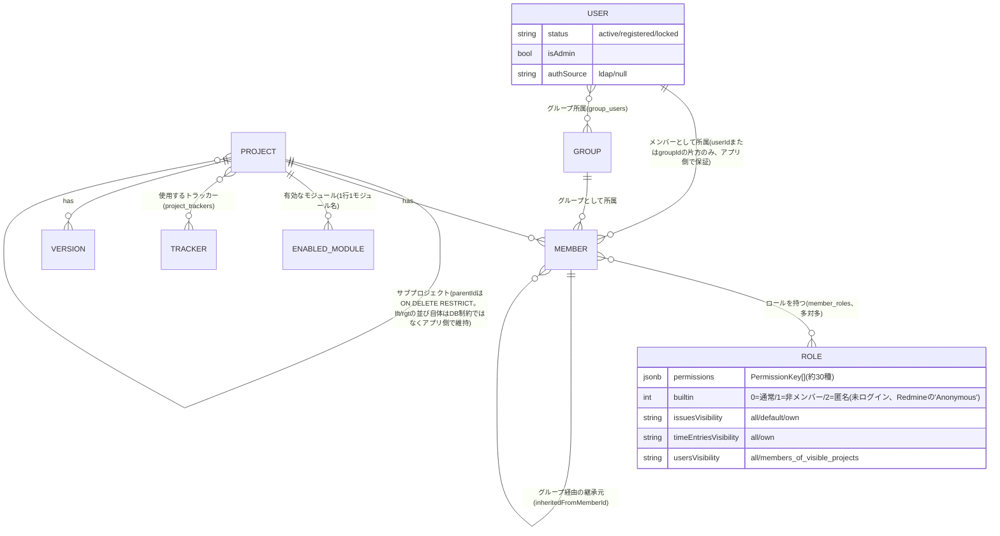
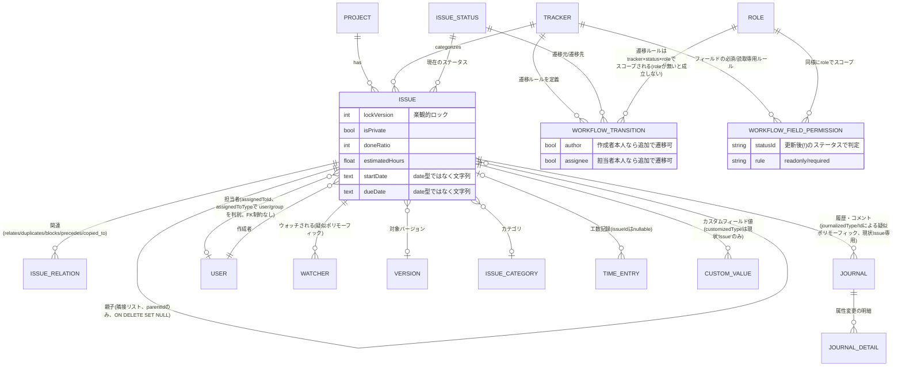
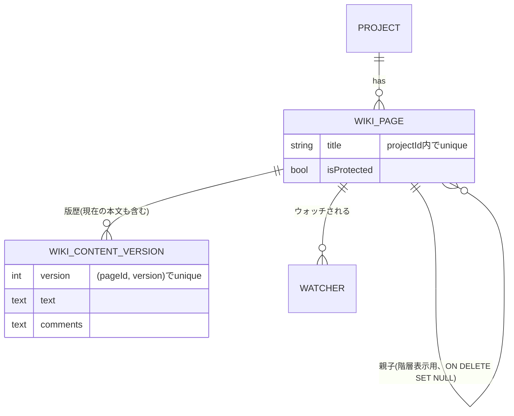
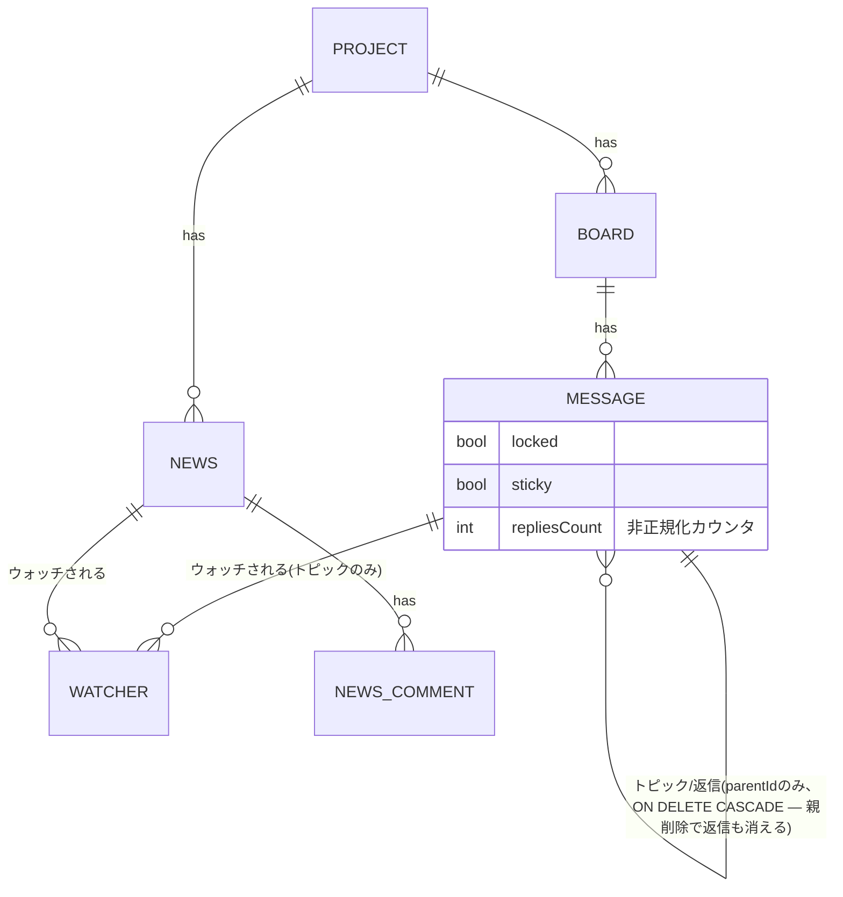
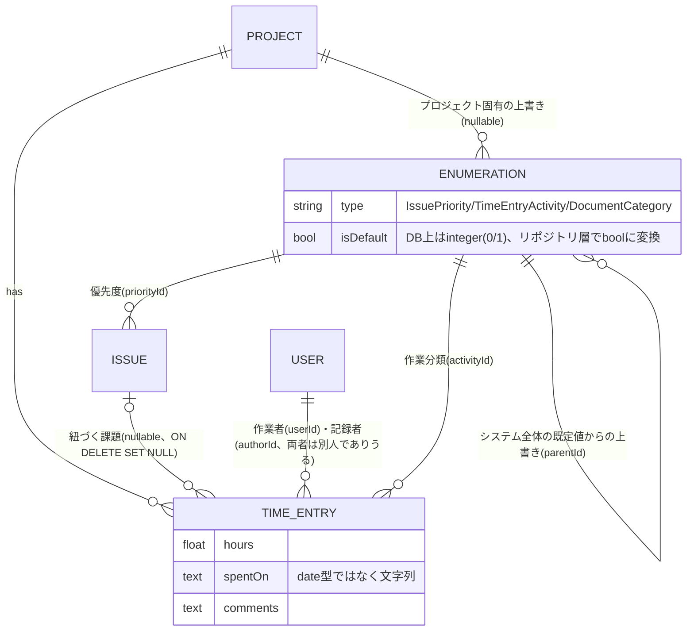
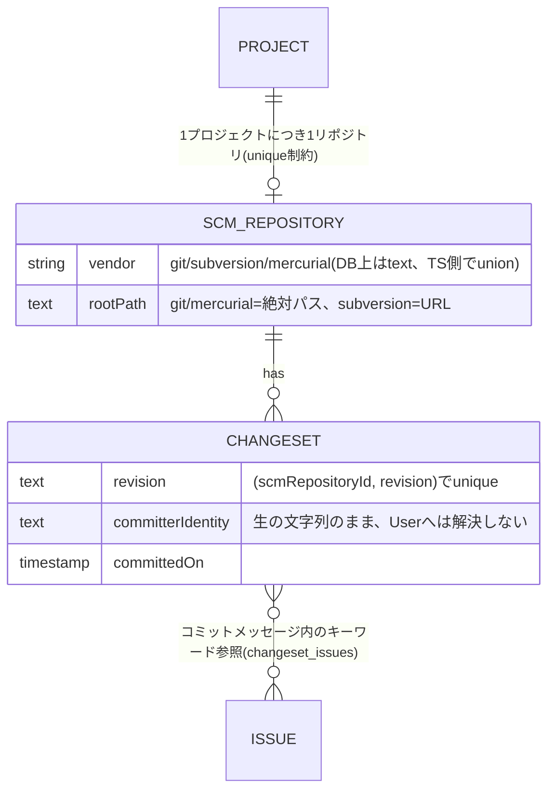
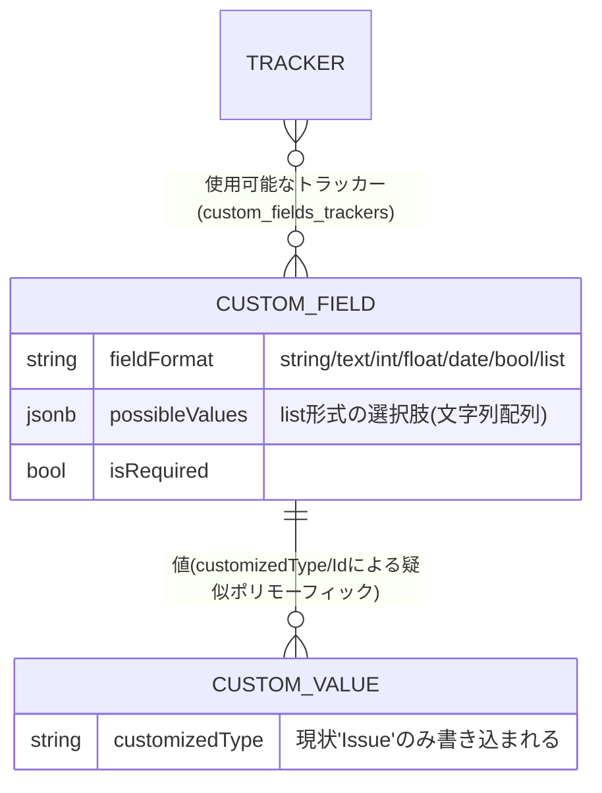
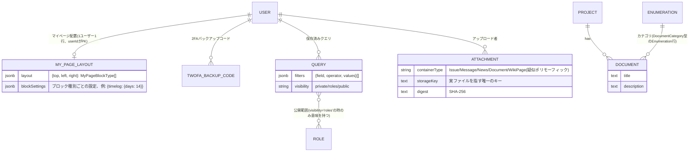

# ドメインモデル

`src/domain/*/entity.ts`(約29領域)を、機能領域ごとに分けて掲載します。1枚のER図に全エンティティを詰め込むと可読性が失われるため、領域をまたぐ関連は各図に重複して登場させています(例: `PROJECT`は全図に登場する)。

テーブル定義の正本は`src/infrastructure/db/schema/*.ts`、TypeScript側の型定義の正本は`src/domain/*/entity.ts`です。この文書はその両者を突き合わせた要約であり、詳細は各ソースファイルを参照してください。

## 表記上の注意: 列挙値はどれもDB側では強制されていない

Drizzleスキーマ上、`text(name, { enum: [...] })`という書き方をしている列(`projects.status`/`users.status`/`custom_fields.fieldFormat`/`issue_relations.relationType`/`jobs.status`/`queries.visibility`/`workflow_field_permissions.rule`など)と、ただの`text()`に`.$type<...>()`だけを付けた列(`versions.status`/`versions.sharing`/`scm_repositories.vendor`/`attachments.containerType`/`watchers.watchableType`/`journals.journalizedType`/`custom_values.customizedType`/`roles.issuesVisibility`など)が混在していますが、**この違いはTypeScript側の型注釈があるかどうかだけ**——Drizzleの`{ enum: [...] }`オプションはPostgresのネイティブENUM型や`CHECK`制約を一切生成せず、生成されるDDLはどちらもただの`text`列です(実際に`drizzle/*.sql`の全マイグレーションを検索しても`CREATE TYPE`/`CHECK`は1件も出てこない)。つまり**「不正な値をDBが拒否する」という保証はこのどちらの書き方にも無く**、両者の違いはコンパイル時にTypeScriptがどこまで値を絞り込めるかだけです。

これと対照的に、**外部キー(FK)による参照整合性は実際にDBが強制する**——例えば`issues.statusId`が存在しない`issue_statuses.id`を指すことはPostgres自身が拒否する。「列挙値の妥当性」と「参照整合性」を混同しないよう、以下のER図やその注記を読む際は区別してください。

## 1. プロジェクト構造・権限

- `Project.enabledModules`/`trackerIds`はエンティティ上のフィールドだが、実体は列ではなく`enabled_modules`テーブルと`project_trackers`中間テーブルからの集約(リポジトリ層が組み立てる)。
- `Member`⇔`Role`は多対多(`member_roles`)。複数ロールを持つ場合、権限は**いずれか一つが許可すればよい**というOR判定(詳細は[`authorization.md`](authorization.md))。
- グループをプロジェクトメンバーに追加すると、そのグループの各ユーザーに対応する**継承済み`Member`行**が1件ずつ生成される(`inheritedFromMemberId`が元のグループ行を指す) — Redmineの`MemberRole#add_role_to_group_users`相当(`application/groups/group-membership.ts`)。
- `Project`の階層は`lft`/`rgt`によるネステッドセット。`parentId`自体はFKとして存在し(`ON DELETE RESTRICT`——子プロジェクトが残ったまま親を削除しようとするとDBが拒否する)、一方で`lft`/`rgt`という並び順の整合性そのものはDBが検証するものではなくアプリ側(`domain/project/nested-set.ts`)が維持する。**`Issue`の親子はネステッドセットではなく単純な隣接リスト**(`parentId`のみ、`ON DELETE SET NULL`) — 意図的な設計簡略化。

## 2. 課題管理

- ステータス遷移(`WorkflowTransition`)・フィールド必須/読取専用(`WorkflowFieldPermission`)の判定ロジックの詳細は[`issue-workflow.md`](issue-workflow.md)。
- `Journal`はコメント本体(`notes`)と属性変更ログ(`JournalDetail`)の両方を1テーブルで表現 — `notes`があればコメント、`details`があれば属性変更(両方持つことも、どちらも空(=journal自体を作らない)もあり得る)。`journalizedType`列自体はDB上ただの`text`(疑似ポリモーフィック)だが、**現状書き込まれるのは`"Issue"`のみ**。
- `Watcher`は`watchableType`(`"Issue" | "News" | "Message" | "WikiPage"`)による疑似ポリモーフィック関連 — 4種すべて実際にウォッチ機能から書き込まれることを確認済み(Issue/News/Message/WikiPageいずれも、ページ側のトグルボタンから対応するServer Actionまで実際に配線されている)。
- `CustomValue.customizedType`も同じ疑似ポリモーフィック構造だが、リポジトリ層のメソッドシグネチャが型引数として`"Issue"`のみをハードコードしており、**実質的にIssue専用**(将来他の型へ拡張する余地は残しつつ、現状は使っていない)。
- `Reaction`(Redmineの👍リアクション相当)は**next-pmに存在しない** — テーブルもエンティティも無い。

## 3. Wiki

- Redmineは「現在の本文(`WikiContent`)」と「版歴(`WikiContentVersion`)」を別テーブルに分けるが、next-pmは**版歴テーブル1本のみ**——「現在の本文」は「そのページの最大version行」として都度導出する、意図的な簡略化。
- **リダイレクト(`WikiRedirect`)に相当する仕組みは無い** — ページ名を変更すると旧タイトルでのアクセスは単純に404になる(Redmine本家との既知のギャップ)。

## 4. フォーラム・News

- `Message`はトピックと返信を同一テーブル・同一モデルで表現(`parentId`が`null`ならトピック)。トピック削除は`ON DELETE CASCADE`で配下の返信も道連れに消える。フォーラムへの投稿(トピック作成・返信)はプロジェクトメンバー+トピックのウォッチャーへ通知メールを送る。
- **Newsの投稿・コメントだけは現状通知(メール)を一切送らない**(フォーラムは送る、Newsだけが送らない——詳細は[`notifications-and-jobs.md`](notifications-and-jobs.md)) — Redmine本家との既知のギャップ。

## 5. 工数管理・列挙値

- `Enumeration`は「優先度」「工数の作業分類」「文書カテゴリ」という3つの異なる概念を`type`列で束ねた1つのポリモーフィックテーブル(Redmineの`Enumeration`のSTIをこの形に写し替えたもの)。`projectId`がnullなら全社共通の既定値、値があればそのプロジェクト固有の上書き。

## 6. SCM(ソースコード管理)

- `vendor`はRedmineの「リポジトリ種別ごとのサブクラス」に相当 — CVS/Bazaar/Filesystemアダプタは意図的に対象外(詳細は[`request-lifecycle.md`](request-lifecycle.md)のSCMアダプタ節)。
- 実際のリポジトリ操作(`log`/`diff`/`blame`/`cat`)は`infrastructure/scm/*-cli-browser.ts`が`git`/`svn`/`hg`バイナリをシェルアウトして行う——このER図が表すのはメタデータのみで、ファイル内容そのものはDBに持たない。
- `committerIdentity`はコミットの生の著者文字列のまま保持し、**`User`へは解決しない**(Redmine本家のコミッターマッピングの曖昧さをそのまま反映)。
- Changesetの一覧・差分・blame結果自体(`TreeEntry`/`Commit`/`BlameLine`型)はDBに永続化されない一時的な値オブジェクト。

## 7. カスタムフィールド

- `fieldFormat`はRedmineの`Redmine::FieldFormat`レジストリの**縮小版** — `enumeration`/`user`/`version`/`attachment`のような「他テーブルを参照する」形式は対象外。
- **`CustomFieldEnumeration`(列挙形式選択肢の位置/有効フラグ付きテーブル)に相当するものは無い** — `fieldFormat`が`enumeration`を持たないことと整合。

## 8. その他(次のいずれにも属さない領域)

- `MyPageLayout`はマイページのブロック配置(詳細は本README脇の機能一覧のみ、設計判断としての解説は無し——実装は素直なCRUD)。`top`/`left`/`right`という固定3カラムに、ブロック種別の配列を保持する。
- 2FA(TOTP)は`users`テーブルに直接カラムを持つ(`twofaScheme`/`twofaTotpKey`/`twofaTotpLastUsedStep`) — 秘密鍵はAES-256-GCMで暗号化して保存(Redmine本家は暗号鍵未設定時に平文保存へフォールバックするが、next-pmはこの経路を持たない)。
- `Settings`テーブルは`(name, value)`のフラットなキー・バリューのみ — Redmineの`Setting`が持つシリアライズ形式/フォーマットカタログは持たない、意図的な簡略化。
- `Job`テーブル(`jobs`)は通知等の非同期処理キュー — 詳細は[`notifications-and-jobs.md`](notifications-and-jobs.md)。
- `Attachment`の`containerType`は型定義上`"Issue" | "Message" | "News" | "Document" | "WikiPage"`の5種を持つが、**実際に書き込まれ・ダウンロード認可も実装されているのはIssue/Document/WikiPageの3種のみ**——Message/Newsへの添付は書き込み経路もダウンロード認可の分岐も無く、実質未配線(型だけ広く、機能はまだ追いついていない状態)。

## 計算結果であって永続化されないモデル

以下はエンティティのように見えるが、テーブルを持たない**読み取り専用の合成モデル**:

| 型 | 用途 |
|---|---|
| `ActivityEvent`(`domain/activity/`) | プロジェクト横断アクティビティフィード。Issue/News/Message/WikiPage/Document/TimeEntry/Changesetの各行から都度合成 |
| `SearchResult`(`domain/search/`) | 全文検索結果 |
| `TreeEntry`/`Commit`/`BlameLine`(`domain/scm/`) | SCMブラウジング結果 |
| Gantt/Calendarのレイアウト型 | 日付グリッド計算結果 |

これらをER図に含めていないのは意図的です — 「今どんなテーブルがあるか」ではなく「今どんな読み取りモデルを合成しているか」は、対応する機能のドキュメント(将来追加する場合)を参照してください。
