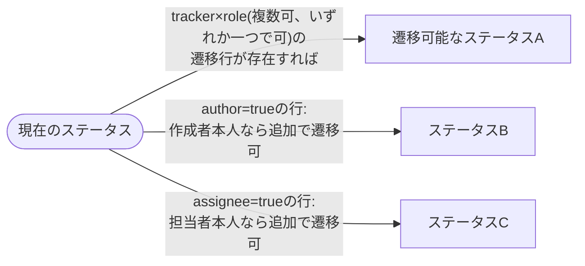
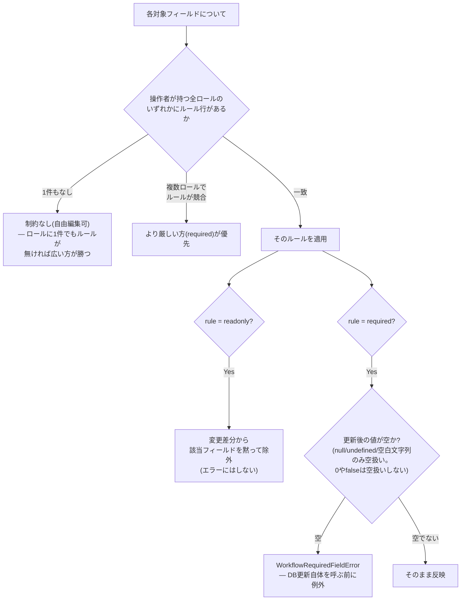
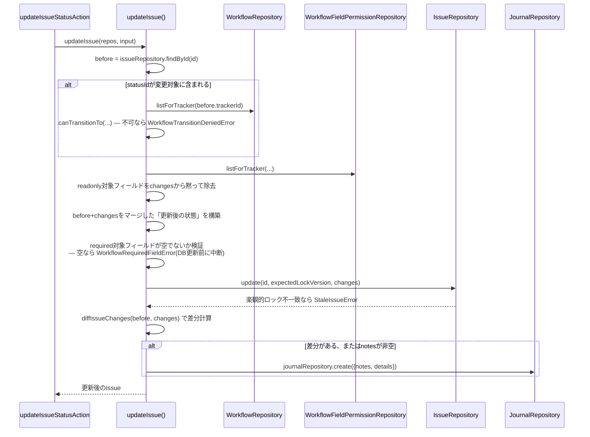

# 課題のライフサイクル

## ステータス遷移(ワークフロー)

`WorkflowTransition`は`(trackerId, roleId, oldStatusId, newStatusId, author, assignee)`の組で「誰が・どのステータスから・どのステータスへ遷移できるか」を表す。判定本体は`domain/workflow/transition-rules.ts`の`canTransitionTo()`/`allowedNewStatusIds()`。



- `allowedNewStatusIds(transitions, query)`は`trackerId`・`currentStatusId`が一致し、`query.roleIds`(操作者が持つ全ロールID)のいずれかと一致する行のうち、`author`/`assignee`フラグが立っていない行は無条件、立っている行は`query.isAuthor`/`query.isAssignee`が真の場合のみ候補に加える。
- **1件でも遷移可能な行があれば、現在のステータス自身も選択肢に戻される**(「変更しない」を選べるように)——逆に言うと、そのトラッカー×ロールに遷移ルールが一つも登録されていなければ、現在のステータスを選び直すことすらできない(Redmineの`new_statuses_allowed_to`と同じ挙動)。
- 管理者(`actor.kind === "admin"`)は`resolveActor`が「全ロールのID」を`roleIds`として返すため、実質的にどのロールの遷移ルールにも一致し、常に最大の選択肢を持つ(詳細は[`authorization.md`](authorization.md))。

## フィールドの必須/読取専用(`WorkflowFieldPermission`)

`(trackerId, roleId, statusId, fieldName)`の組で、そのステータスにおいてそのフィールドが`readonly`か`required`かを表す。対象フィールドは`WORKFLOW_ELIGIBLE_FIELDS`(`subject`/`description`/`assignedToId`/`priorityId`/`categoryId`/`fixedVersionId`/`startDate`/`dueDate`/`doneRatio`/`estimatedHours`/`isPrivate`)——`statusId`自体(遷移テーブルの管轄)と`parentId`(next-pmの更新フローは親付け替え自体を未サポート)、カスタムフィールドは対象外。

**重要な注意点**: ここでの`statusId`はRedmineの実装同様「更新**後**のステータス」を指す(`WorkflowTransition.oldStatusId`が「更新前」を指すのとは逆)——`Issue#safe_attributes=`がステータスを先に代入してからフィールドルールを計算するのと同じ順序。



## 更新処理全体の適用順序

`application/issues/update-issue.ts`が実際に呼ばれる順序は以下の通り(コメントではなく実装の順序そのもの):



- ステータス遷移の可否検証が**フィールド権限より先**に評価される。
- 必須フィールドの検証は「`before`と`changes`をマージした後の値」に対して行う——REST APIはPATCHでも常に全キーを送ってくる可能性があるため、「キーが存在するがundefined」(=未変更)と「明示的な`null`」(=クリア)を区別している。
- 必須項目が空のまま検出された場合、**DB更新は一切呼ばれない**(検証はすべてDB書き込みの前)。

## 楽観的ロック

`Issue.lockVersion`をDBレベルの単一の条件付きUPDATEで守る:

```sql
UPDATE issues SET ..., lock_version = lock_version + 1
WHERE id = ? AND lock_version = ?
```

0行しか更新されなければ(バージョンが既に進んでいた場合も、行自体が削除されていた場合も同様に)`StaleIssueError`を投げる——アプリ側でのリトライ/マージは行わず、呼び出し元(Server Action)が「他の変更と競合しました。再読み込みしてください」というエラーに変換して返す。

## 履歴(Journal)

1回の更新につき`Journal`行1つ + 属性変更ごとの`JournalDetail`行。`diffIssueChanges(before, changes)`(`domain/journal/diff-issue.ts`)が固定の`TRACKED_FIELDS`(`statusId`/`priorityId`/`subject`/`assignedToId`/`fixedVersionId`/`categoryId`/`isPrivate`/`doneRatio`/`estimatedHours`/`startDate`/`dueDate`)を走査し、値が実際に変わったフィールドだけ`{property:"attr", fieldName, oldValue, newValue}`を生成する。

- 差分が1件もなく`notes`も空文字列なら、**Journal行自体を作らない**(コメントもステータス変更も無い無意味な更新はログに残さない)。
- **`description`の変更は差分として記録されない**——`WORKFLOW_ELIGIBLE_FIELDS`(フィールド権限の対象)には含まれるが`TRACKED_FIELDS`(履歴記録の対象)には含まれていない、既知の非対称。Redmine本家は本文の差分もjournalに残すため、この点はnext-pmの方が狭い。
- `JournalDetail.property`は`"attr" | "cf" | "relation"`の3種の型を持つが、現状`diffIssueChanges`が生成するのは`"attr"`のみ("cf"=カスタムフィールド変更、"relation"=関連変更は将来用に型だけ用意されている)。

## Redmine本家との既知のギャップ

next-pmの`update-issue.ts`は以下のRedmine機能を**一切持たない**(部分実装ではなく、完全に未着手):

- **クローズ時の副作用なし**: 「クローズすると複製課題も自動クローズ」「ブロックされている/未クローズの子課題を持つ課題はクローズ不可」に相当するロジックが存在しない。クローズは他のステータス変更と全く同じ、ワークフロー遷移とフィールド権限だけに従う単なる遷移。
- **親子の集計ロールアップなし**: 子課題の作成・更新・ステータス変更で親の`doneRatio`/`startDate`/`dueDate`/優先度を再計算する仕組みが無い。そもそも`IssueUpdate`型に`parentId`が含まれておらず、**更新時の親付け替え自体が未サポート**(作成時のみ指定可能)。
- **`precedes`/`follows`からの自動リスケジュールなし**: `IssueRelation`に`delay`列は存在し保存もされるが、実際に日付をずらすロジックがどこにも無い(値は保持されるが「不活性」)。先行課題の日付を変えても後続課題は一切追従しない。
- **関連作成時の循環/祖先子孫チェックなし**: `createIssueRelation`はコード上のコメントで明記された意図的な簡略化として、自己関連・同一プロジェクト・重複行のみを検証し、Redmine本家が行う循環依存検証は行わない。

これらはいずれも「将来追加しうる機能」として明確に切り分けられており、次に着手する際はこのセクションを更新すること。
