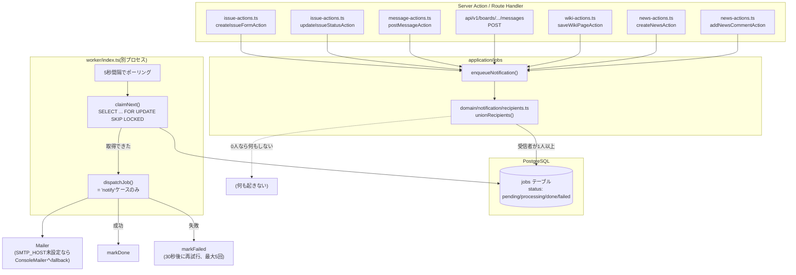
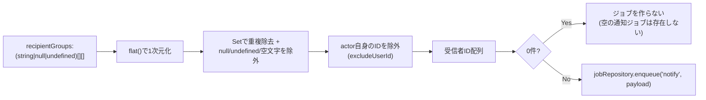
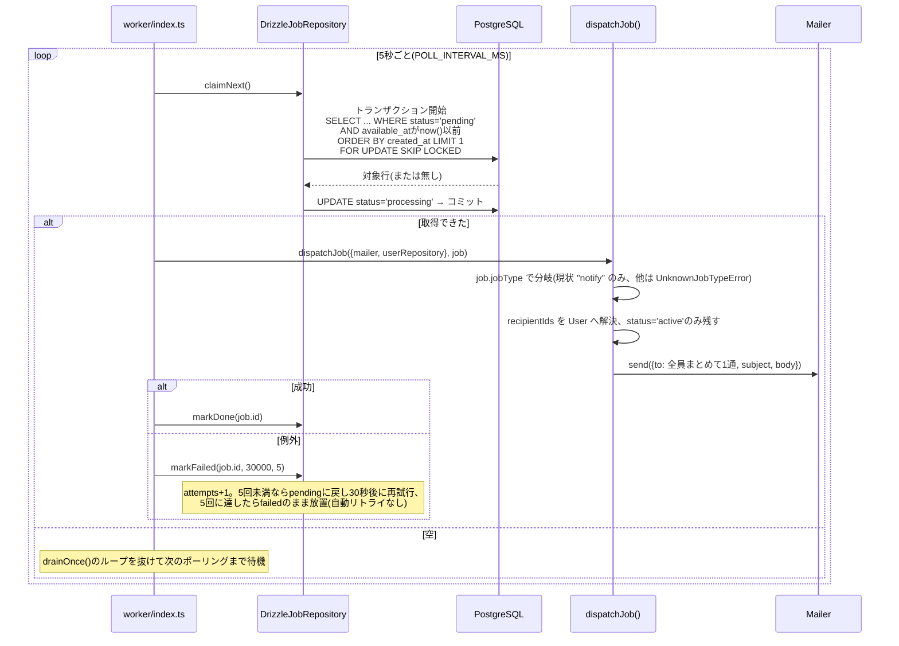
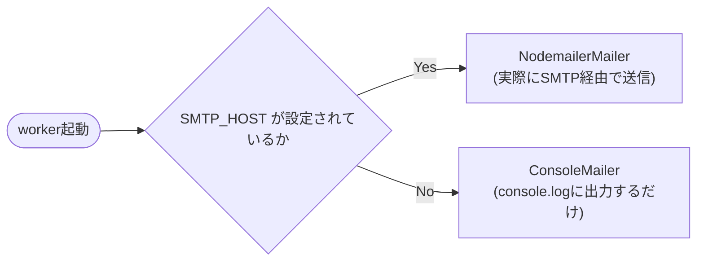

# 通知パイプラインとバックグラウンドジョブ

## 全体像

next-pmの非同期処理は**「notify」という1種類のジョブしか存在しない、単一の常時ポーリングワーカー**という、Redmine本家(Webhook・複数のcron的rakeタスク)よりもずっと小さい構成になっている。

## `enqueueNotification`の呼び出し箇所

| # | 発生源 | 通知先(unionされるグループ) | 除外 |
|---|---|---|---|
| 1 | `issue-actions.ts` `createIssueFormAction` (課題作成) | `[作成者+担当者(グループ担当ならグループ全員に展開), 非公開可視性フィルタ済みの全メンバー]` | 作成者自身 |
| 2 | `issue-actions.ts` `updateIssueStatusAction` (ステータス更新/コメント追加) | `[作成者+担当者, 非公開可視性フィルタ済みの全メンバー, ウォッチャー]` | 更新者自身 |
| 3 | `message-actions.ts` `postMessageAction` (フォーラム投稿、Web UI) | `[全メンバー, トピックのウォッチャー]` | 投稿者自身 |
| 4 | `api/v1/boards/[boardId]/messages` POST (フォーラム投稿、REST API) | #3と同一 | 投稿者自身 |
| 5 | `wiki-actions.ts` `saveWikiPageAction` (Wiki編集・作成) | `[view_wiki_pages権限を持つ全メンバー, そのページのウォッチャー]` | 編集者自身 |
| 6 | `news-actions.ts` `createNewsAction` (News投稿) | `[view_news権限を持つ全メンバー]` | 投稿者自身 |
| 7 | `news-actions.ts` `addNewsCommentAction` (Newsコメント) | `[News投稿者, view_news権限を持つ全メンバー, そのNewsのウォッチャー]` | コメント投稿者自身 |

- 課題作成(#1)とNews投稿(#6)にはウォッチャーが含まれない——作成直後にはまだ誰もウォッチしていないため。
- 非公開課題向けの可視性フィルタ(`filterMembersVisibleToPrivateIssue`)はRedmineの`Issue#notified_users`の`reject! {|user| !visible?(user)}`を移植したもの——詳細は[`authorization.md`](authorization.md)の可視性節。
- Wiki/News(#5〜#7)は非公開課題のような特別な可視性ルールを持たないが、モジュール自体が無効化されたロール(またはそもそも`view_wiki_pages`/`view_news`を持たないロール)のメンバーにまで送るのは望ましくないため、`domain/member/entity.ts`の`filterMembersWithPermission()`(汎用の権限フィルタ、#1/#2の`rolesById`パターンを一般化したもの)で絞り込んでいる。フォーラム投稿(#3/#4)は対照的に**フィルタなしで全メンバーに送る**——これは既存の簡略化で、Wiki/News追加時にも変更していない。

## 受信者解決(`unionRecipients`)

- ロジックは「候補プールを全部unionしてから、1回だけ除外・重複排除する」という単純な形——Redmineの`mail_notification`ティア(all/selected/only_my_events/only_assigned/only_owner/none)や`Setting.notified_events`によるイベント単位のオプトインは**一切実装されていない**(コード上のコメントで明記された意図的な範囲外)。
- 結果として、**現状は「union後の全員に無条件でメールする」以外の選択肢がユーザー側に無い**——自分の変更についても自分だけは除外されるが、これは固定の挙動でありオプトイン/オプトアウトの余地は無い。

## ジョブテーブルとワーカー

`jobs`テーブル: `id, jobType, payload(jsonb), status(pending/processing/done/failed), attempts, availableAt, createdAt`。

- `claimNext()`は`FOR UPDATE SKIP LOCKED`によるPostgresの行ロック——ワーカープロセスを複数並列稼働させても安全。
- ジョブ1件ごとの通知は**受信者全員をまとめた1通のメール**(`to:`に全員を並べる、個別送信でもBCCでもない)。
- リトライは固定30秒後・最大5回——指数バックオフではない。
- ワーカーは`worker/index.ts`という別プロセス(`bun run worker` = `tsx watch worker/index.ts`)。`worker/health-server.ts`がHono製の`/healthz`(ポート3001)をおまけで立てている(コンテナのヘルスチェック用)。

## メール送信先の選択

`worker/index.ts`起動時に一度だけ、`SMTP_HOST`環境変数の有無で`Mailer`実装を選ぶ:

本文はプレーンテキストのみ(`text:`)——HTML本文には対応していない。

## スケジュール実行(cron相当)は存在しない

`src`・`worker`配下を"cron"/"autofetch"/"prune"/"sweep"/"scheduler"等で全文検索した結果、**next-pmには時刻トリガーで動く処理が一つも無い**ことを確認済み。具体的には:

- SCMリポジトリの自動フェッチ(Redmineの`autofetch_changesets`)に相当する定期実行は無い——「リポジトリを同期」ボタンを押した瞬間にServer Action内で**同期的に**changeset取り込みが走るのみ(ジョブテーブルを経由しない)。
- 期限切れの一時アップロード(添付ファイル)には**掃除の仕組み自体が無い**——`application/attachments/upload-token.ts`のコード上のコメントはRedmineの`Attachment.prune`を引き合いに出しているが、実際にコードがしているのは「そのトークンを引き換えようとした瞬間、24時間を過ぎていれば引き換え自体を拒否する」という期限チェックのみ(`redeemUploadToken`)——`AttachmentRepository.delete()`はどこからも呼ばれておらず、期限切れの行やストレージ上の実ファイルは**削除されずに残り続ける**。同期的な遅延実行ですらなく、単なる「無期限に溜まる」状態。
- ウォッチのプルーニング、Webhook配信なども同様に**存在しない**(Webhook機能自体がnext-pmに無い)。

この「非同期処理はnotifyジョブ1種類・時刻トリガーは一切無し」という構成は、将来SCM自動フェッチや添付ファイルの定期GCを追加する際に、既存の`jobs`テーブル+ワーカーへ新しい`jobType`を足すだけでは済まない(時刻トリガー自体の仕組みが無い)ことを意味する——新機能として別途スケジューラ(cronプロセス、または`pg_cron`等)を導入する必要がある。
