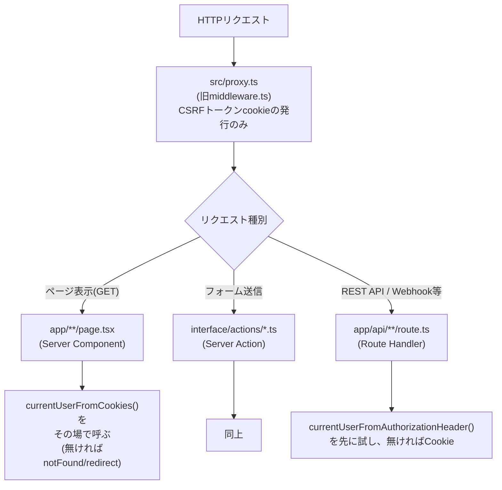
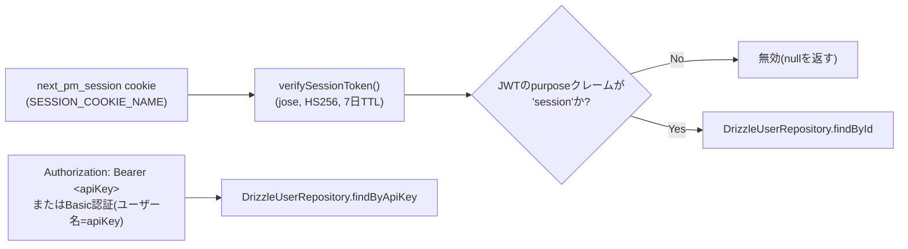
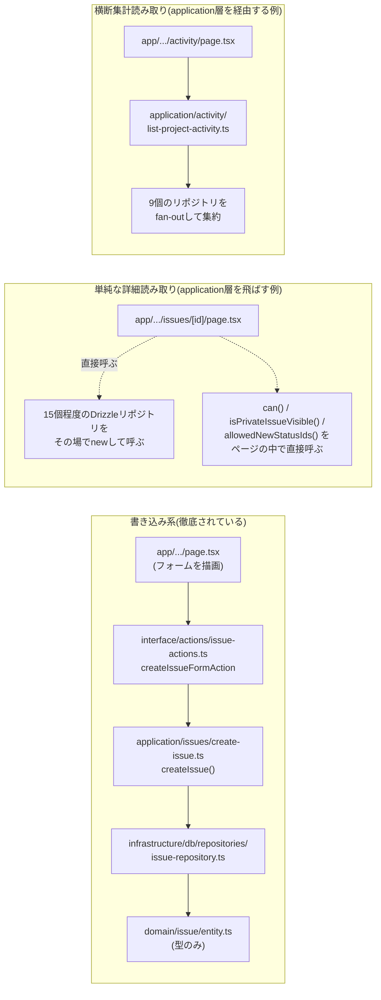
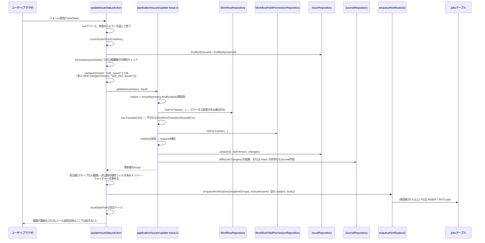

# リクエストライフサイクル

## ミドルウェア相当の層

next-pmには**Next.js 16の`proxy.ts`(旧`middleware.ts`)以外に、中央集権的な認証ミドルウェアは存在しない**。認証チェックは各ページ(Server Component)・各Server Action・各Route Handlerが個別に、その場で行う。

- `src/proxy.ts`がやっていることは1つだけ: リクエストに`next_pm_csrf`cookieが無ければ発行する(ダブルサブミット方式のCSRF対策用)。**未ログインをリダイレクトする機能は無い**。
- 「保護されたページ」は`page.tsx`の中で`const user = await currentUserFromCookies(); if (!user) redirect("/login")`のようなチェックを個別に書く——共通ガードの仕組みは無く、書き忘れれば素通りする(レビュー観点として明示しておく価値がある)。

## セッション/認証の実体

- `purpose: "session"`というクレームは意図的な作り込み——2FA未完了状態を表す一時トークン(同じくJWT、`userId`クレームを持つ)と、同じ`JWT_SECRET`で署名されていても**構造的に区別**するためのガード。`purpose`が一致しないトークンは即座に無効。
- REST API(`app/api/v1/**`)は`Authorization`ヘッダのAPIキーを先に試し、無ければCookieにフォールバックする`resolveUser()`をルートごとに定義している(共通ヘルパーではなく各route.tsが同じ形を繰り返す)。

## CSRF検証

`interface/http/csrf.ts`の`verifyCsrf()`はダブルサブミットcookie方式(`next_pm_csrf`cookie値と`x-csrf-token`ヘッダを比較)。**呼ばれるのはRoute Handler(`app/api/**/route.ts`)だけ**——Server Action(`interface/actions/*.ts`)からは一度も呼ばれない。Server ActionはNext.js自体が同一オリジン検証を組み込みで行うため、二重にCSRF検証を積む必要が無いという判断。

Route Handler内でも、**Cookie経由で認証された場合のみ**CSRF検証を行う(`viaCookie`フラグで分岐) — APIキー/Basic認証はブラウザの暗黙的な資格情報を伴わないため、CSRFの対象外(Redmine本家のトークン認証時の`protect_from_forgery`スキップと同じ理屈)。

## 4層構成の実際の呼び出しチェーン

READMEに書かれている`domain → application → infrastructure → interface → app`という層構成が、実コードでどこまで徹底されているかを確認した:

- **書き込みは例外なくServer Action → application層のユースケース関数**という経路を通る。
- **1画面ぶんの単純な詳細表示**(例: 課題詳細ページ)は、application層を経由せずページ(Server Component)がリポジトリ・ドメイン純関数を直接呼ぶことが多い——「単一エンティティ+その周辺情報をそのまま並べるだけ」の読み取りは薄いページ実装で済ませる、という次善の判断。
- **複数のリポジトリを横断して合成する読み取り**(アクティビティフィード、検索、マイページ、管理設定画面)は`application/`配下に専用の関数を置く——artisan-pmの「Serviceを必ず経由する」ほど厳格ではないが、「非自明な集約ロジックはapplication層に置く」という一貫性は保たれている。

## 例: ステータス更新→通知エンキューまでのフルパス

実際にメールが送られるまでの後半(ワーカーがジョブを拾ってから)は[`notifications-and-jobs.md`](notifications-and-jobs.md)を参照。

## REST API(`/api/v1/**`)の特徴

ダッシュボードページと同じ`resolveActor`/`can()`/リポジトリのパターンを踏襲しつつ、次の点が異なる:

- 認証はAPIキー(`Authorization`ヘッダ)優先、Cookieはフォールバック。
- 応答は`NextResponse.json(...)`(JSXではない)。
- 書き込み系は、Cookie認証の場合のみCSRF検証を通す。
- 使うユースケース関数はダッシュボードのServer Actionと**同じもの**(例: `POST /api/v1/issues`も`application/issues/create-issue.ts`の`createIssue()`を呼ぶ)——ロジックの二重実装を避けている。

## Server ComponentでもRoute HandlerでもないHTTPレスポンス

Livewireに相当する「部分HTML差分更新」という制約がNext.jsには無いため、next-pmではPDF/Atom/CSV/添付ファイルのような特殊なレスポンスも**同じ`app/api/**/route.ts`という置き場所**に素直に共存している(Laravel版のように別Controller層を作る必要が無い):

| 用途 | パス |
|---|---|
| 添付ファイルダウンロード | `app/api/attachments/[id]/route.ts` |
| プロジェクトアクティビティAtomフィード | `app/api/projects/[identifier]/activity/atom/route.ts` |
| 課題CSVエクスポート | `app/api/projects/[identifier]/issues/csv/route.ts` |
| 課題PDFエクスポート | `app/api/projects/[identifier]/issues/pdf/route.tsx`(`@react-pdf/renderer`) |
| ガントチャートPDF | `app/api/projects/[identifier]/gantt/pdf/route.tsx`(HTML版と同じレイアウト計算を共有) |
| Wikiエクスポート(HTML/PDF/ZIP) | `app/api/projects/[identifier]/wiki/export/{html,pdf,zip}/route.ts` |
| 受信メール処理(課題の自動作成・返信) | `app/api/mail_handler/route.ts` |

- `activity/atom/route.ts`だけは認証方式がさらに特殊——CookieかAPIキーに加えて、クエリ文字列に埋め込む専用の`atomKey`トークンも受け付ける(フィードリーダーはCookieもカスタムヘッダも送れないため)。一般のAPIキーとは意図的に別のトークンにしてあり、クエリ文字列がログ/ブラウザ履歴/Refererに漏れても影響範囲をフィード閲覧のみに限定している。`Referrer-Policy: no-referrer`も同じ理由でセットされる。
- 添付ファイルダウンロードは画像やHTMLであっても常に`Content-Disposition: attachment`を強制する——同一オリジンでの保存型XSSを防ぐため。
- 受信メール処理(`mail_handler`)はCookie/APIキーのどちらでもなく、`timingSafeEqual`による共有シークレット比較(`MAIL_HANDLER_API_KEY`)——環境変数が未設定ならエンドポイント自体が無効化される。
